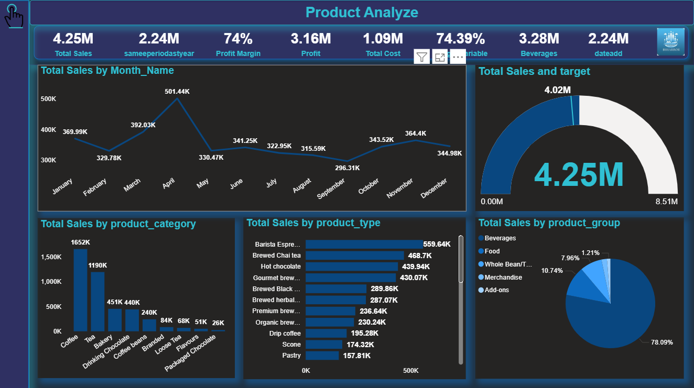

# 📊 Product Analysis Power BI Dashboard

This Power BI dashboard presents a comprehensive **Product Analysis** report, highlighting sales trends, performance metrics, and product-level insights for a retail business. The visualizations are designed to help stakeholders monitor sales performance, identify top-performing products, and evaluate profitability over time.

---

## 📁 Overview

This dashboard provides insights into:

- **Total Sales and Profitability**
- **Sales Trends by Month**
- **Product Performance by Category, Type, and Group**
- **Sales Targets vs Actual**
- **Key Performance Indicators (KPIs)**

---

## 📌 Key Metrics

| Metric               | Value      |
|----------------------|------------|
| **Total Sales**       | 4.25M      |
| **Same Period Last Year** | 2.24M |
| **Profit**            | 3.16M      |
| **Total Cost**        | 1.09M      |
| **Profit Margin**     | 74%        |
| **Profit % (Variable)**| 74.39%    |
| **Sales from Beverages** | 3.28M |
| **Date Added**        | 2.24M      |

---

## 📅 Total Sales by Month

Visualized using a line chart to show monthly trends. Notable observations:

- **Peak Sales** in **April (501.44K)**
- **Lowest Sales** in **September (296.31K)**
- Steady increase again from **October to November**

---

## 🧃 Total Sales by Product Category

Bar chart highlighting sales by product categories:

- **Top Category**: Coffee (1.65M)
- Followed by: Tea (1.19M), Bakery (451K), Drinking Chocolate (440K)
- Niche Categories: Tea Flavors, Packaged Chocolate

---

## 🧪 Total Sales by Product Type

Horizontal bar chart showing detailed product types:

- **Top Products**:
  - Barista Espresso: 559.64K
  - Brewed Chai Tea: 468.7K
  - Hot Chocolate: 439.94K
  - Gourmet Brew: 430.07K

Other items like pastries and scones are also included for food category insights.

---

## 🎯 Total Sales vs Target

- Gauge visual compares actual sales (**4.25M**) to the target (**8.51M**)
- Visual cue for how close we are to achieving the sales goal

---

## 🧊 Total Sales by Product Group (Pie Chart)

- Beverages dominate with **78.09%**
- Food: 10.74%
- Whole Bean/Tea: 7.96%
- Add-ons: 1.21%
- Merchandise also included

---

## 📌 Technologies Used

- **Power BI Desktop**
- DAX for calculated fields (Profit, Profit Margin, etc.)
- Custom visuals (gauge, pie, line, and bar charts)

---

## ✅ Features Implemented

- KPI Tiles for quick overview
- Time-series analysis using month-based breakdown
- Multi-level product drilldowns (category → type → group)
- Target comparison using gauge chart
- Interactive and color-coded design for easy readability

---

## 📷 Screenshot

> *Note: Replace image path if stored elsewhere.*

---

## 📈 Use Cases

- Business performance tracking
- Product-level sales strategy
- Inventory prioritization
- Financial planning and forecasting

---

## 🧠 Future Improvements

- Dynamic filters by region/store
- Integration with real-time data
- Drillthrough pages for detailed category analysis

---

## 🧑‍💼 Author

Created by [Your Name]  
Power BI Developer | Data Analyst

---

